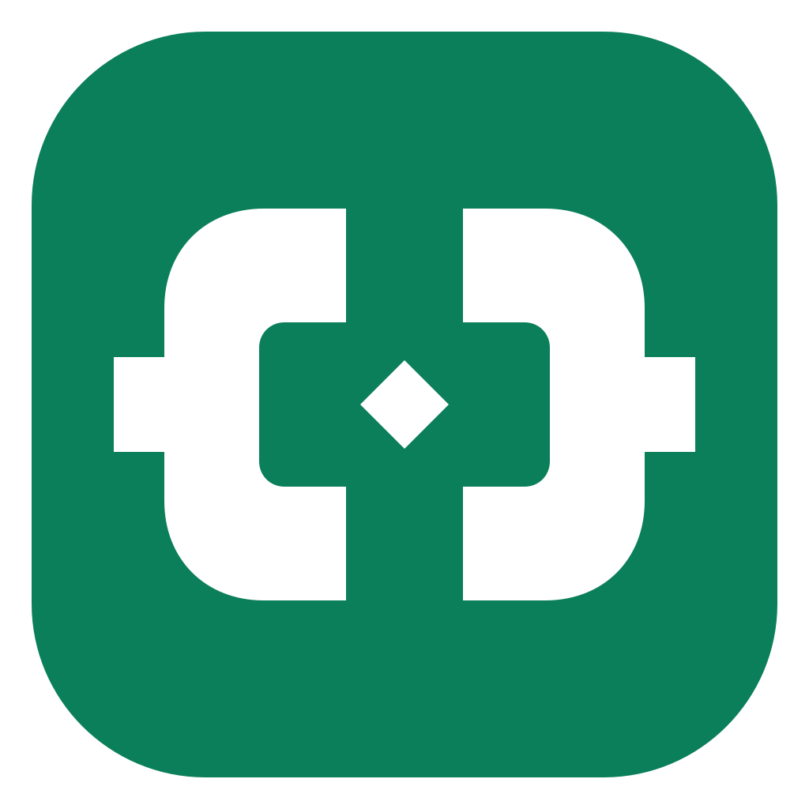

# Local Ops

<p align="center">
  
</p>

<p align="center">
  面向 macOS 的本机服务控制台：统一管理服务、SSH 隧道、Docker 容器、终端操作和易记的 <code>*.localhost</code> 地址。
</p>

<p align="center">
  <a href="README.md">English</a> ·
  <a href="https://github.com/Arvinnma/local-ops-console/releases/latest">下载最新版</a> ·
  <a href="docs/USER_GUIDE.zh-CN.md">完整使用手册</a> ·
  <a href="SECURITY.md">安全说明</a>
</p>

Local Ops 把 Electron 桌面 App、浏览器控制台、Process Compose 和 Caddy 打包进一个可拖拽安装的 DMG。它适合需要长期运行多个本地进程和 SSH 转发，又希望集中查看、开关和访问这些资源的开发者。

> [!WARNING]
> Local Ops 可以执行当前 macOS 用户配置的命令。控制 API、SSH 监听和反向代理目标均刻意限制在本机回环地址，请勿把控制台暴露到局域网或公网。

## 系统要求

- Apple Silicon（`arm64`）Mac
- macOS 12 Monterey 或更高版本
- Docker 功能可选；使用时需要安装 Docker Desktop
- 系统自带 Terminal.app；iTerm2 为可选项

v1.8.2 暂不提供 Intel（`x64`）安装包。

## 功能一览

| 模块 | 能力 |
| --- | --- |
| 服务 | 添加 Node / 命令服务，启动、停止、重启、编辑、拖拽排序、健康检查和查看日志 |
| SSH 隧道 | 管理只绑定回环地址的本地转发，支持开机网络门控、5 秒快速失败、3 秒自动重试、有限重试和两层链路检查 |
| SSH 敏感信息 | 验证加密私钥口令，并且只保存到 macOS 钥匙串 |
| 现有服务 | 监控由其他 App 管理的端点，不重复接管进程 |
| 反向代理 | 使用 `http://api.localhost` 或 `panel.localhost/admin` 访问本机服务 |
| Docker | 打开 Docker Desktop，并启动、停止或重启已有容器 |
| 终端操作 | 在 Terminal.app / iTerm2 中执行保存的命令、SSH 登录或 SSH 转发 |
| 菜单栏 | 使用 330 像素紧凑面板直接开关资源和打开地址 |
| 会话恢复 | 可选：仅恢复上次打开 App 时仍在运行的资源 |
| 配置迁移 | 导入导出配置，但不复制 Docker 状态、密钥、令牌或系统授权 |
| 语言 | 网页、桌面菜单、启动页和菜单栏面板支持简体中文 / 英文切换 |

## 安装

1. 从 [Releases](https://github.com/Arvinnma/local-ops-console/releases/latest) 下载 `Local-Ops-1.8.2-arm64.dmg`。
2. 打开 DMG，把 **Local Ops** 拖到“应用程序”。
3. 从“应用程序”启动 **Local Ops**。

第一次启动会把内置后台安装到 `~/.local/share/local-ops`，并注册当前用户的 LaunchAgent。安装包已经包含 Caddy、Process Compose 和原生钥匙串 Helper；普通安装用户不需要 Node.js、Homebrew、Caddy 或 Process Compose。

以后用新版 App 替换“应用程序”里的旧版时，原有配置、会话记忆和本机随机 API 密钥都会保留。

### Gatekeeper 提示

社区版 DMG 使用 ad-hoc 签名，尚未经过 Apple 公证。如果 macOS 首次阻止打开，请在“应用程序”中按住 Control 点击 **Local Ops**，选择“打开”并确认。正式公证分发需要 Apple Developer ID。

### 可选的无端口访问

Caddy 默认监听 `127.0.0.1:19080`。设置页可以安装一个仅作用于本机回环地址的 macOS 规则，把本机 80 端口转发到 Caddy。macOS 只会要求一次管理员密码；启用后可直接访问 `http://openclaw.localhost`，不用再写 `:19080`。该规则可随时在设置中关闭并清理。

## 第一次使用

1. 进入“服务 → 添加资源”，填写工作目录和启动命令。
2. 如需易记地址，可同时配置本地域名和服务端口。
3. 在“SSH 隧道”添加本地转发，并填写本机 HTTP 健康检查地址；私钥已加密时，可在表单中把口令保存到钥匙串。
4. 已经由其他工具启动的服务，可只在“反向代理”或“现有服务”中配置，不重复接管。
5. 点击 macOS 菜单栏的 Local Ops 图标，使用第一层快捷开关。
6. 如需记忆运行状态，再开启“启动 App 时恢复上次运行状态”；该功能默认关闭。

总览中的“需要关注”可以展开完整清单，显示每个停止、健康检查失败或离线资源，并跳转到对应页面。

连接前，Local Ops 会先读取有效 SSH 配置（包括主机别名对应的真实 `HostName/Port`）并探测该端点。开机网络尚未就绪时，卡片保持“连接中”，并在“SSH 主机网络”中说明正在等待网络；端点恢复后会在下一次 3 秒重试内立即连接，不使用固定长延迟。隧道不再随服务调度器自行启动：网页、菜单栏和批量按钮触发的手动连接最多重试 3 次；开启“启动 App 时恢复上次运行状态”后，开机恢复的隧道最多重试 40 次。额度耗尽后才进入“连接失败”，黄色按钮会重新开始一轮 3 次的手动重试。

隧道只有在本机 HTTP 链路检查收到有效响应后才显示“已连接”。如果已配置的反向代理目标对应这条隧道，Local Ops 还会自动检查包含访问路径的完整 `.localhost` 地址，并分别显示“SSH 隧道：已连接”和“域名入口：已就绪 / 未就绪”；两层都成功时卡片才显示“已连接”。完整入口来自现有反向代理配置，不需要在 SSH 隧道中重复填写。

字段填写示例、钥匙串行为、开机语义、备份范围、CLI、升级、卸载和排错方法见[完整使用手册](docs/USER_GUIDE.zh-CN.md)。

## 架构

```text
Local Ops.app / 浏览器
          │
          ▼
本机控制 API（127.0.0.1:19090）
          │
          ├── Process Compose Core（控制台、Caddy、服务调度器）
          ├── Process Compose Worker（用户服务、SSH 隧道）
          ├── Caddy（127.0.0.1:19080，可选回环 80 端口入口）
          └── Docker CLI / Terminal.app / iTerm2（仅按需调用）
```

用户服务运行在独立 Worker 中，修改配置时只热更新 Worker，不会重启桌面窗口、网页控制台或 Caddy。

## 命令行

安装器能写入标准 Homebrew bin 目录时，会创建 `localops` 命令：

```bash
localops status
localops open
localops start
localops stop
localops restart
localops logs <进程ID> 300
localops process start <进程ID>
localops process stop <进程ID>
localops process restart <进程ID>
localops tui
localops tui-core
```

项目自带终端脚本会加载用户 shell 环境，并在系统存在 `proxy_on` 命令时优先执行它。

## 本机数据与隐私

Local Ops 不需要账号或云服务，运行数据只保存在本机：

- `~/.local/share/local-ops/config/catalog.json`：资源与偏好
- `~/.local/share/local-ops/config/last-session.json`：可选的运行状态记忆
- `~/.local/share/local-ops/config/process-compose.token`：本机随机 API 密钥
- `~/.local/share/local-ops/runtime/`：进程和控制面日志
- macOS 登录钥匙串：加密私钥口令

可迁移导出不会包含 Docker 资源、运行状态记忆、API 密钥、私钥内容、私钥口令、钥匙串随机引用、系统端口或管理员授权。

## 从源码构建

构建环境需要 Apple Silicon Mac、Node.js 22.12+、npm、Caddy 与 Process Compose：

```bash
brew install node caddy
brew install f1bonacc1/tap/process-compose
npm ci
npm run check
npm test
npm run build:keychain
npm run test:keychain
cd desktop
npm ci
npm run dmg
```

安装包输出到 `desktop/dist/Local-Ops-1.8.2-arm64.dmg`。打包步骤会把当前 Caddy 与 Process Compose 二进制复制进 App。

修改打包、原生 Helper、回环监听或 Electron 安全设置前，请先阅读[开发与发布文档](docs/DEVELOPMENT.md)。

## 发布验收

v1.8.2 发布门禁覆盖：语法和单元测试、中英文静态文案覆盖、配置往返、API 安全校验、服务生命周期与日志、SSH 网络门控与有限重试、完整域名入口检查、Caddy 路径路由、Docker 容器读取、加密私钥钥匙串集成、登录项静默启动、菜单栏重复恢复窗口、窄窗口浏览器 QA、App 签名与架构、挂载 DMG 的布局/签名检查，以及安装到“应用程序”后的启动冒烟测试。

## 参与开发

欢迎提交 Issue 和 Pull Request。请先阅读 [CONTRIBUTING.md](CONTRIBUTING.md)，提交前运行 `npm run check` 与 `npm test`，用户可见改动同步更新中英文，并保留 [SECURITY.md](SECURITY.md) 中的本机安全边界。

## 许可证

项目使用 [MIT License](LICENSE)，第三方说明见 [THIRD_PARTY_NOTICES.md](THIRD_PARTY_NOTICES.md)。

## 友情链接

- **[linux.do](https://linux.do)** — 新的理想型社区
