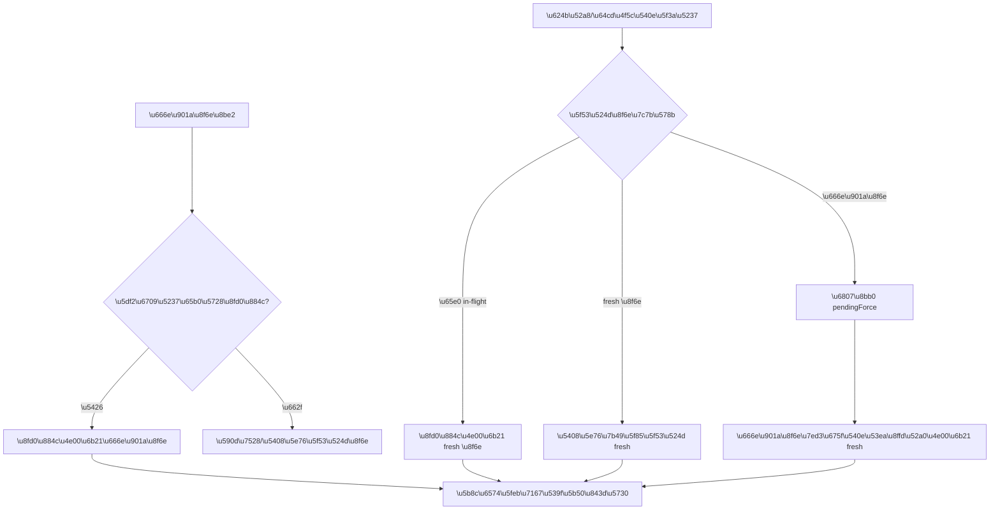

# Local Ops 刷新与 SSH 状态一致性修复方案

> 状态：已确认并完成源码实施与隔离验收；Git 提交与私有 Forgejo 推送已获授权，公开 GitHub、构建、安装、Release 与实机验收仍待独立授权
>
> 日期：2026-08-14
>
> 适用项目：`local-ops-console`
>
> 权威源码：`/Users/arvin/Documents/AI/codex/local-ops-console`
>
> 当前审查基线：`main` / `239e901966e84828bd08550e3a2b240852b613d3`

## 1. 文档用途与审批边界

本文档最初是对本次 `review_complete` 结果的实施设计。用户已确认按方案开工，当前保留它作为源码实施与隔离验收记录。

写入本文档不代表已授权执行修复。在用户明确回复“确认按方案开工”之前：

- 不修改业务代码；
- 不构建 DMG；
- 不替换 `/Applications/Local Ops.app`；
- 不覆盖 `/Users/arvin/.local/share/local-ops`；
- 不停止或重启 Local Ops、Caddy、Process Compose、用户服务或 SSH 隧道；
- 不提交、推送、打标签或发布 Release。

开工时的授权仅覆盖“源码修改 + 自动化测试 + 隔离环境验收”。2026-08-14 后续指令已经单独授权更新文档、Git 提交与私有 Forgejo 推送；公开 GitHub、构建、安装、实机运行态验收和 Release 仍是独立步骤，尚未授权。

## 2. 当前现场与保护条件

### 2.1 当前已有未提交修改

当前工作树已有用户修改：

- `.project-foundation.yaml`
- `docs/current-state.md`
- `docs/testing/README.md`

实施时必须在改动前冻结这三份 diff。若后续需要补充 `docs/current-state.md` 或 `docs/testing/README.md`，只能基于当前磁盘内容做局部增补，不得覆盖或重写用户已有内容。

`.project-foundation.yaml` 与本次功能修复无关，禁止顺手处理。

### 2.2 源码、安装和运行层必须分开

| 层级 | 路径 | 本轮规则 |
| --- | --- | --- |
| 权威源码 | `/Users/arvin/Documents/AI/codex/local-ops-console` | 确认方案后可修改 |
| 当前安装 App | `/Applications/Local Ops.app` | 源码阶段不触碰 |
| 后台、catalog 与运行数据 | `/Users/arvin/.local/share/local-ops` | 源码阶段不触碰 |
| 日志 | `/Users/arvin/Library/Logs/Local Ops` | 只读取证，不清理、不改写 |

### 2.3 当前版本是两条独立基线

- 源码与已发布公开 Release：`1.8.5`；
- 当前本机安装 App / 运行副本：`1.8.4`。

这种差异是当前客观现场，不能因为源码测试通过就把文档改成“已安装”或“已发布”。如果这批修复最终发布，建议使用新的 patch 版本 `1.8.6`，不原地替换已发布的 `v1.8.5` 制品。

## 3. 审查结论

### 3.1 本次确认的问题

本次审查没有发现 P0/P1 级别的数据破坏或远程安全问题，但确认了七项会造成界面状态错乱、动作误判或发布混淆的 P2 问题：

1. **主界面刷新没有串行化**

   `public/app.js` 的普通轮询、手动强刷和操作后强刷可以重叠。旧的慢响应可以比新响应更晚落地，将新状态回退为旧状态。

2. **`bootstrap` 与 `state` 不是原子快照**

   现有普通轮询已经同时请求 `/api/bootstrap` 和 `/api/state`，资源同步能力已经存在；问题是两次 HTTP 请求分别读取 catalog，并且独立返回。当配置在两个请求之间变化时，可能出现“配置已有新资源，运行状态还是旧列表”的混合帧。

3. **菜单栏的强刷可能被普通刷新吞掉**

   `refreshTraySnapshot(true)` 遇到已在运行的普通刷新时，直接复用当前 Promise，没有确保随后真正执行 `fresh=1`。

4. **菜单栏刷新会误报成功，且容易丢失旧快照**

   `refreshTraySnapshot()` 内部捕获异常后不再拋出，手动刷新调用方仍可显示“状态已刷新”。单次健康检查失败时，`updateTray(false)` 还会立即清空快照，使菜单栏列表瞬间消失或显示空状态。

5. **控制面健康检查对短暂超时过于敏感**

   当前 `checkHealth()` 只做一次 1.2 秒探测。一次调度延迟或短暂忙碌就能将控制面判为离线，引起 `online/offline` 抖动和快照清空。

6. **菜单栏与主界面的 SSH 动作契约不一致**

   主界面按四态处理隧道：已连接→停止，已停止→启动，最终连接失败→重试，连接中→不可点击。菜单栏却主要根据 `active` 决定“停止/启动”。当 SSH 进程仍存活、但域名入口已进入终态失败时，主界面是“重试”，菜单栏点击却可能变成“停止 SSH”。

7. **历史错误与当前错误没有分层，版本也缺少自动一致性门禁**

   `runtime.lastError` 和 `runtime.lastDomainError` 是有价值的历史诊断，但当隧道恢复后对外仍可以出现旧错误。同时，源码、Electron package、锁文件、静态资源查询版本和打包 manifest 之间没有统一检查，容易出现混合制品。

### 3.2 已确认不是本次要重做的功能

- 主界面的普通轮询已会读取 `state` 和 `bootstrap`；本次是修正并发和原子性，不是重新实现资源同步。
- 当前截图中“6/11 运行”与当时运行数据一致，不能仅凭红色条目数量就认定界面丢数据。
- SSH 主机网络、SSH/TCP 隧道存活、可选 HTTP 应用 readiness 和完整域名入口 readiness 必须继续保持分层。
- HTTP `401/403` 对完整域名入口仍表示“请求已到达受保护应用”，不应改成失败。
- HTTP readiness 失败只允许降级应用状态，不能结束仍然存活的 SSH 隧道。
- ProxyJump / ProxyCommand 由 OpenSSH 委派连接的逻辑、`ConnectTimeout=5`、`ConnectionAttempts=1`、人工 3 次/会话恢复 40 次重试、域名入口 30 秒恢复探测，本次全部保留。

## 4. 修复目标

### 4.1 刷新正确性

1. 任意时刻最多只有一轮主状态计算正在执行。
2. 普通轮询并发到达时合并为一次。
3. 强刷到达时：
   - 如果没有正在刷新，立即跑一次真正的 fresh 计算；
   - 如果普通轮正在运行，等普通轮结束后再跑一次 fresh 计算；
   - 如果 fresh 轮已在运行，所有强刷调用合并等待同一轮。
4. 操作后刷新必须等到真正 fresh 结果已经落地，才能显示操作完成。
5. 旧响应不得覆盖新响应。

### 4.2 主界面与菜单栏一致性

1. 主界面与菜单栏使用同一组 SSH 显示状态和动作规则。
2. 菜单栏在执行动作前必须用最新快照再计算一次动作，不能把旧快照的“停止”施加到已变成“连接中”的资源。
3. 刷新失败时保留最后一次成功快照，明确标记“旧数据/刷新失败”，不再把列表清空。
4. 使用旧快照时，服务、SSH、Docker 和终端命令等会改变运行态的操作一律禁用；刷新、显示控制台、打开日志和只读打开反向代理地址可以保留。

### 4.3 错误字段语义

1. 用户卡片的主错误区只显示“当前最终失败”。
2. 已连接、已停止、连接中和自动重试中必须清空对外的当前错误字段。
3. 最后一次错误作为历史诊断保留，但放入独立的只读 `diagnostics`，不再与当前状态混用。

### 4.4 版本与制品一致性

1. 源码中的所有版本入口必须能由自动检查保证一致。
2. 打包后必须验证 DMG 文件名、Info.plist、`bundle-manifest.json` 和源码 package 是同一版本。
3. 安装版本、已发布版本和源码 HEAD 继续作为三条独立证据报告。

## 5. 明确不做的范围

本次不借机扩展为大规模重构，不做以下内容：

- 不引入 WebSocket、SSE 或新的全局状态库；
- 不增加第三方依赖；
- 不修改 catalog 持久化格式；
- 不修改 Keychain 引用或读取逻辑；
- 不修改 SSH 重试上限、重试间隔、连接超时和 ProxyJump / ProxyCommand 规则；
- 不将 HTTP readiness 重新变成会结束 SSH 进程的 liveness；
- 不改动服务、Docker、反向代理和终端任务的业务逻辑；
- 不重新设计当前 UI 布局；
- 不在本批修复中解决 Apple Silicon 以外的打包问题。

## 6. 总体架构

### 6.1 统一快照模型

新增一个只读端点：

```http
GET /api/snapshot?fresh=0|1&docker=0|1
```

建议返回：

```json
{
  "schemaVersion": 1,
  "catalogRevision": "<non-secret-revision>",
  "generatedAt": "2026-08-14T00:00:00.000Z",
  "bootstrap": {},
  "state": {},
  "docker": null
}
```

契约：

- 一次请求开始时只加载一次 catalog；
- `bootstrap` 和 `state` 必须由这一份 catalog 生成；
- `docker=0` 时 `docker` 为 `null` 或省略；
- `docker=1` 时 Docker 查询失败不能让基础快照整体失败，应在 Docker 子对象中返回错误；
- `fresh=1` 必须真正绕过普通缓存，不能复用正在运行的非 fresh 结果；
- 现有 `/api/bootstrap`、`/api/state` 和 `/api/docker` 全部保留，不破坏外部调用者。

`catalogRevision` 使用 Node.js 内置 `crypto` 对已允许返回前端的 `publicCatalog(catalog)` 做稳定摘要。`publicCatalog` 已删除 `passphraseRef`，只保留 `hasKeyPassphrase` 布尔值；不得对私钥、口令、CSRF token 或 Keychain 内容做摘要并返回。

### 6.2 刷新单飞协调器



协调器必须同时解决两种竞态：

1. **请求竞态**：并发请求不能无限叠加。
2. **落地竞态**：开始时更早、结束时更晚的计算不能覆盖更新数据。

后端使用 cache epoch：

- `invalidateState()` 同时清缓存并递增 epoch；
- 一轮计算开始时捕获 epoch 和 `catalogRevision`；
- 计算结束时，只有 epoch 和 revision 都未变化才能写回缓存；
- 这可以防止“修改资源后 invalidate，但修改前的慢计算稍后又把旧值写回”。

前端使用单调 apply generation：

- 每一轮真正请求取得 generation；
- 只有当前最新 generation 的完整快照才能一次性替换 `ui.bootstrap`、`ui.state` 和可选 `ui.docker`；
- 不能逐个子对象落地，不能在同一帧中混合不同 revision。

### 6.3 快照状态与降级策略

主界面和菜单栏统一采用：

| `snapshotState` | 含义 | 列表 | 运行态操作 |
| --- | --- | --- | --- |
| `empty` | 尚无成功快照 | 显示加载/离线空态 | 禁用 |
| `refreshing` | 正在取得新快照 | 继续显示旧快照，并显示刷新中 | 禁用，避免用旧状态操作 |
| `fresh` | 最近一轮成功 | 显示新快照 | 按契约启用 |
| `stale` | 刷新失败，保留上次成功快照 | 显示旧快照和“上次成功时间/当前错误” | 状态修改操作禁用 |

还需保存：

- `lastSuccessfulAt`；
- `lastRefreshError`（必须经现有错误清理逻辑截断，禁止回显 token、命令环境或私钥路径细节）；
- 当前是否有 fresh 轮在运行。

## 7. 分阶段实施设计

### 阶段 A：后端原子快照与缓存串行化

预计修改：

- `src/server.mjs`
- 必要时新增一个可独立测试的纯逻辑帮助模块，例如 `src/state-refresh.mjs`
- 新增对应单元测试

改动：

1. 将 `getState()` 中的真实计算拆成不直接写缓存的 `computeState(catalog)`。
2. 在外层实现普通/fresh 单飞协调。
3. 引入 epoch 和 `catalogRevision` 检查，阻止旧计算回写。
4. 新增 `/api/snapshot`，一次读 catalog 后组装 `bootstrap/state/docker`。
5. 保留现有三个 GET API，并让其复用同一套底层协调逻辑。
6. mutation 完成后的 `invalidateState()` 必须在运行配置已成功生效后再递增 epoch。

完成条件：

- 同一 catalog revision 的 `bootstrap` 和 `state` 不再混帧；
- 普通轮运行期间到达的 fresh 请求一定会再运行一轮；
- invalidate 之前开始的慢计算不会回写缓存。

### 阶段 B：主界面刷新协调器

预计修改：

- `public/app.js`
- 建议新增 `public/refresh-coordinator.js`，使并发语义可以在不启动浏览器的情况下精确测试
- 新增 `tests/refresh-coordinator.test.mjs`
- 必要时小幅调整 `public/index.html` / `public/styles.css` 的刷新状态文案与样式

改动：

1. 轮询、手动刷新和 mutation 后刷新统一走 refresh coordinator。
2. 主界面改用 `/api/snapshot`。
3. 只在完整快照成功且 generation 仍是最新时一次性 apply。
4. `ui.busy` 只表示 mutation，不再兼任刷新锁。
5. 定时轮询失败时保留旧 UI，不因一次快照失败就清空页面或把 Process Compose 状态改写为离线。
6. 手动刷新失败显示错误 toast；手动刷新只有在 fresh apply 成功后才显示成功。
7. mutation 完成后等待的是 fresh apply Promise，不是已在运行的普通轮。

可以加 AbortController 作为请求超时保护，但不能依赖“取消旧请求”代替 generation 和单飞的正确性。

### 阶段 C：菜单栏刷新、旧快照和健康去抖

预计修改：

- `desktop/main.cjs`
- `desktop/tray.js`
- 必要时小幅调整 `desktop/tray.html` / `desktop/tray.css`
- 建议拆出小型、纯逻辑的 `desktop/tray-refresh.cjs` 或 `desktop/control-health.cjs`，便于单元测试
- 扩展 `tests/tray-action.test.mjs`，新增刷新/健康测试

刷新契约：

1. `refreshTraySnapshot(force)` 不再在函数内部吞掉错误。
2. 后台轮询调用方显式 `.catch(log)`；手动刷新让异常继续返回 IPC 调用方。
3. 强刷到达普通 in-flight 时，追加一次 fresh 轮，不复用普通轮。
4. 刷新开始时立即向菜单栏推送 `refreshing`，刷新结束后再推送 `fresh/stale`。
5. 打开菜单栏时顺序改为：标记刷新→推送带旧快照的 refreshing 状态→显示面板→刷新完成后更新。
6. 成功时才替换 `traySnapshot`；失败保留上次成功数据并记录 `lastRefreshError`。

健康去抖：

1. 将底层探测改为返回 `{ ok, error, latencyMs }`，不再只有布尔值。
2. 第一次 1.2 秒探测失败时，先保留在线状态，在 300–500 毫秒后进行一次最多 2 秒的确认探测。
3. 两次都失败才转入 offline/stale。
4. 任何一次成功都立即复位失败计数。
5. 从 offline 恢复时立即触发一次 fresh 刷新。
6. 日志分别记录首次失败、确认失败、恢复和探测耗时，便于区分真实宕机与短暂忙碌。

### 阶段 D：SSH 显示/动作契约统一

预计修改：

- `desktop/main.cjs`
- 建议新增可测试的 `desktop/tunnel-action.cjs`
- `desktop/tray.js`
- `public/tunnel-ui.js`（仅在需要修正契约出口时改动）
- `tests/tray-action.test.mjs`
- `tests/tunnel-ui.test.mjs`
- 一组主界面/菜单栏共用的状态 fixture

统一契约：

| 显示状态 | 关键条件 | 主操作 | 菜单栏是否允许点击 |
| --- | --- | --- | --- |
| `connected` | SSH/TCP 健康，已配置域名入口也已就绪 | `stop` | 是，保留真实点击、确认弹窗和审计头 |
| `stopped` | 显式停止/禁用 | `start` | 是 |
| `connection_failed` + active | SSH 仍存活，但完整入口最终失败 | 立即重新探测域名入口 | 是，文案显示“重试”，不重启或停止健康 SSH |
| `connection_failed` + inactive | SSH 已终止且重试额度用尽 | `start` | 是，文案显示“重试” |
| `connecting` / `waiting_network` / `retrying` / `restarting` | 系统正在尝试 | 无 | 否 |
| busy | 当前资源已有 mutation | 无 | 否 |

具体要求：

1. `buildTrayPanelState()` 为每条隧道显式写入 `displayState` 和解析后的 `operation`，渲染层不从颜色或 `active` 自行推断。
2. `performTrayPanelAction()` 执行前从最新快照重新解析 operation。
3. 如果点击时的 operation 与执行前已不同，拒绝旧动作并刷新，不发送 mutation。
4. 对“SSH 健康、仅域名入口终态失败”的隧道，新增一个不改变进程期望状态的立即入口复查路径，重置域名恢复节流后立即执行一次 fresh state 计算。不得调用 Process Compose restart。
5. 只有 SSH/TCP 本身最终失败时，“重试”才按 inactive→start、active 异常态→restart 处理。
6. 服务和 Docker 继续保留当前契约，不借机重构。
7. 不为共用 20–30 行状态映射引入新构建层；通过共用 fixture 同时验证两个 mapper，防止后续漂移。

### 阶段 E：当前错误与历史诊断分离

预计修改：

- `src/tunnel-health.mjs`
- `public/tunnel-ui.js`
- `tests/tunnel-health.test.mjs`
- `tests/tunnel-ui.test.mjs`

对外契约：

```json
{
  "status": "connected",
  "lastConnectionError": "",
  "lastConnectionErrorAt": null,
  "domainEntry": {
    "lastError": "",
    "lastErrorAt": null
  },
  "diagnostics": {
    "lastConnectionError": "Permission denied (publickey)",
    "lastConnectionErrorAt": "2026-08-14T00:00:00.000Z",
    "lastDomainError": "HTTP 502",
    "lastDomainErrorAt": "2026-08-14T00:01:00.000Z"
  }
}
```

规则：

- 现有 `lastConnectionError/At` 字段类型不变，但语义收紧为“当前可展示错误”；
- 只有最终 `connection_failed` 暴露当前连接错误；
- connected、stopped、connecting 和 retrying 都返回空错误；
- `domainEntry.lastError/At` 只在域名入口最终失败时暴露；
- ready、not_configured 和自动重试中返回空的当前域名错误；
- 内部 `runtime.lastError*` / `runtime.lastDomainError*` 保留历史，用于 `diagnostics`；
- 不新增数据库、catalog 字段或持久化迁移，持久诊断仍以日志为准；
- 对现有 API 只做加法式扩展。如有外部调用者把 `lastConnectionError` 当成历史字段，Release Notes 需明确改读 `diagnostics.lastConnectionError`。

### 阶段 F：版本和制品门禁

此阶段在 A–E 源码修复通过后执行，但仍不代表已安装或发布。

预计修改：

- `package.json`
- `desktop/package.json`
- `desktop/package-lock.json` 顶层版本
- `public/index.html` 的静态资源 `?v=`
- 新增 `scripts/check-version-consistency.mjs`
- 将版本检查并入 `npm run check`
- 只在相应阶段更新 `CHANGELOG.md` 和发布文档

源码门禁检查：

- 根 `package.json` 版本；
- `desktop/package.json` 版本；
- `desktop/package.json` 的 `build.mac.bundleVersion`；
- `desktop/package-lock.json` 根版本和顶层 package 版本；
- `public/index.html` 静态资源查询版本。

打包后门禁检查：

- DMG 文件名与预期版本；
- `CFBundleShortVersionString` / `CFBundleVersion`；
- `bundle-manifest.json.version`；
- arm64 架构；
- `hdiutil verify`；
- `codesign --verify --deep --strict`；
- DMG 挂载布局和 Applications 拖拽入口；
- 关键源码在 repository / packaged App 之间的 SHA-256。

## 8. 文件级改动清单

| 文件 | 预计改动 | 不允许的扩展 |
| --- | --- | --- |
| `src/server.mjs` | 快照 API、后端单飞、epoch/revision 缓存 | 不改 mutation 业务逻辑 |
| `src/state-refresh.mjs` （可选新增） | 可测试的单飞协调 | 不引入新依赖 |
| `public/refresh-coordinator.js` （建议新增） | 浏览器轮询/fresh 协调和 generation | 不改导航与资源业务 |
| `public/app.js` | 原子 apply、刷新状态、mutation 后 fresh | 不重设 UI |
| `desktop/main.cjs` | 菜单栏刷新、旧快照、健康去抖、动作再校验 | 不改 App 启动/关闭语义 |
| `desktop/tray.js` | 渲染 refreshing/stale，按 operation 禁用动作 | 不调整菜单分组 |
| `desktop/tray.css/html` （按需） | 旧快照和刷新状态的最小提示 | 不改面板宽度和整体视觉 |
| `desktop/tunnel-action.cjs` （建议新增） | 菜单栏 SSH 动作解析纯函数 | 不重构服务/Docker |
| `src/tunnel-health.mjs` | 当前错误与历史 diagnostics 分离 | 不改 readiness/liveness 规则 |
| `public/tunnel-ui.js` | 校验四态和当前错误显示 | 不新增第五个用户状态 |
| `scripts/check-version-consistency.mjs` （新增） | 源码版本门禁 | 不调用网络 |
| `tests/*.test.mjs` | 并发、动作、错误、健康和版本回归 | 不连真实生产 catalog |

最终实施时以当前代码结构为准。如果不新增帮助文件也能获得同等可测试性，可以减少文件数；但不能因此放弃竞态测试。

## 9. API 与兼容性

### 9.1 保留的契约

- `/api/bootstrap`、`/api/state`、`/api/docker` 保留；
- 所有现有 mutation 路径保留；
- catalog JSON 结构保留；
- Keychain 引用保留；
- 进程生命周期审计头保留；
- 用户看到的 SSH 四态保留。

### 9.2 加法式扩展

- 新增 `/api/snapshot`；
- 隧道返回对象新增 `diagnostics`；
- 菜单栏内部状态新增 `snapshotState`、`lastSuccessfulAt`、`lastRefreshError`、`displayState` 和 `operation`。

### 9.3 需要在 Release Notes 说明的语义收紧

`lastConnectionError` 从“最后一次发生的错误”收紧为“当前最终失败可展示错误”。需要历史诊断的调用者改读 `diagnostics.lastConnectionError`。字段类型不变，不是破坏性 schema 升级。

## 10. 自动化测试矩阵

### 10.1 后端刷新与缓存

1. 三个并发普通请求只调用一次 compute。
2. 普通轮中插入 fresh，总共调用两次 compute，第二次必须 fresh。
3. 多个并发 fresh 合并为一次。
4. 普通轮失败后，排队的 fresh 仍必须执行。
5. 计算期间发生 invalidate，旧计算不得写入缓存。
6. `catalogRevision` 不同时不得命中旧缓存。
7. `/api/snapshot` 的 `bootstrap/state` 使用同一 revision。
8. Docker 查询失败时，基础 snapshot 仍然成功。
9. revision 输入不含 `passphraseRef`、CSRF token 或任何 Keychain 值。

### 10.2 浏览器刷新

1. 轮询重叠时只发起一轮。
2. 普通轮期间点击手动刷新，会在普通轮后真正发起 fresh。
3. 两个手动强刷合并。
4. 慢旧响应比新响应晚返回时，不得覆盖新 UI。
5. 一轮失败时保留上次快照。
6. mutation 调用等到 fresh apply 而不是普通 in-flight。
7. snapshot 中只有 Docker 错误时，非 Docker 页面继续正常更新。

### 10.3 菜单栏刷新和健康

1. 手动刷新失败向 IPC 调用者 reject，不显示“已刷新”。
2. 后台轮询失败只记录日志，不引发 unhandled rejection。
3. 刷新开始和结束都推送面板状态。
4. 刷新失败保留旧快照，标记 stale，且所有 mutation 操作禁用。
5. 普通轮中请求 fresh，会追加一次 fresh。
6. 第一次健康探测超时，不立即 offline。
7. 确认探测也失败才 offline/stale。
8. 一次成功会复位失败并在恢复时触发 fresh。
9. offline/stale 期间旧列表不丢失。

### 10.4 SSH 动作契约

1. connected + active：主界面和菜单栏都是 stop。
2. stopped：两端都是 start。
3. connecting / waiting_network / retrying：两端都禁用，且不发送 API mutation。
4. domain terminal failure + active：两端都是“重试入口探测”，SSH PID/listener/restart count 不变，绝不能 stop 或 restart SSH。
5. SSH terminal failure + inactive：两端都是 retry/start。
6. busy：两端都禁用。
7. 点击后、执行前状态改变：拒绝旧动作并刷新。
8. stop 仍需真实点击、确认弹窗和完整审计头。

### 10.5 错误字段和恢复

1. SSH 最终失败显示当前错误。
2. retrying/connecting 不显示当前错误，但 diagnostics 保留历史。
3. connected 后当前错误为空，diagnostics 保留历史。
4. stopped 后当前错误为空。
5. 域名终态失败只暴露域名当前错误。
6. 域名恢复为 `200/401/403` 后，当前错误清空，历史保留。
7. 连续不同错误会更新历史错误时间。
8. 没有 `healthUrl` 和没有域名入口的隧道行为不退化。

### 10.6 版本门禁

1. 源码所有版本入口一致时通过。
2. 任意一个版本被人为改成不一致时，`npm run check` 失败并指出文件。
3. 打包后 manifest、Info.plist、DMG 文件名和源码版本一致。

## 11. 源码阶段验证

用户确认开工后，先只运行不触碰生产 catalog 和安装副本的门禁：

```bash
proxy_on >/dev/null 2>&1
npm run check
npm test
node --test \
  tests/refresh-coordinator.test.mjs \
  tests/tray-action.test.mjs \
  tests/tunnel-health.test.mjs \
  tests/tunnel-ui.test.mjs
git diff --check
```

其中定向文件名可根据最终实现调整。需要启动假控制面的测试必须使用临时目录、随机端口和伪 catalog，不得读写：

- `/Users/arvin/.local/share/local-ops/config/catalog.json`；
- 真实 Process Compose API；
- 真实 SSH 监听端口；
- 真实 Docker 容器。

`npm run test:smoke` 和 `npm run test:browser` 只能在审查临时资源 ID 和清理路径后，使用隔离 catalog 执行；不将它们对生产环境执行。

## 12. 隔离运行验收

自动化门禁通过后，使用 fake control server 和隔离 Electron/DOM harness 验收：

1. 让第一个 snapshot 延迟 2 秒，第二个延迟 50 毫秒，确认第一个响应晚到后不会回退 UI。
2. 普通刷新运行时连续点击两次手动刷新，确认只追加一次 fresh。
3. 让 snapshot 请求超时，确认主界面和菜单栏保留旧列表、显示 stale、禁用 mutation。
4. 让控制面健康探测失败一次后恢复，确认不转 offline。
5. 让两次健康探测都失败，确认转 stale 但不丢失快照。
6. 模拟域名终态失败但 SSH 仍 active，确认主界面与菜单栏都是“重试”，只重新探测入口，不发送 stop/restart SSH。
7. 在点击后更改资源状态，确认执行前再校验拒绝过期动作。

本阶段不需要启动或停止真实 SSH 隧道。

## 13. 打包阶段（需独立授权）

只有当源码阶段通过且用户明确要求构建时，才执行：

```bash
proxy_on >/dev/null 2>&1
npm run build:dmg
```

只构建 DMG，不运行 `scripts/build-app.zsh`，因为后者会退出、覆盖并重新打开 `/Applications/Local Ops.app`。

构建后需记录：

- 源码 HEAD；
- 制品绝对路径；
- SHA-256；
- `hdiutil verify` 结果；
- `codesign --verify --deep --strict` 结果；
- 架构；
- Info.plist 版本；
- `bundle-manifest.json` 版本；
- 应用包布局。

构建通过仍只能报告“制品已验证”，不能报告“已安装”或“运行中已生效”。

## 14. 安装后实机验收（需独立授权）

安装可能替换内置后台并影响 Process Compose Worker。必须避开 Restic、大文件传输或其他不可中断任务。

### 14.1 安装前

1. 备份当前 `/Applications/Local Ops.app`，记录版本与 SHA-256。
2. 记录所有已运行 SSH 隧道的：
   - ID；
   - SSH PID；
   - 本地 listener；
   - Process Compose restart count；
   - 当前健康和域名入口状态。
3. 确认没有重要传输任务。
4. 导出配置只用于回滚保险，不读取、输出或提交秘密。

### 14.2 安装后

1. 验证 App、内置 manifest 和运行后台版本一致。
2. 比对 repository / App bundle / 运行副本中关键刷新和 tunnel-health 文件 SHA。
3. 连续点击菜单栏刷新，同时让主界面轮询，确认不回退、不闪空、不误报成功。
4. 打开/隐藏菜单栏至少 5 次，确认打开时立即显示 refreshing，之后转 fresh。
5. 隔离模拟一次控制面慢响应，确认旧快照保留、变更操作禁用。
6. 对同一条最终失败隧道，确认主界面与菜单栏的文案、颜色和点击动作一致。
7. 隧道恢复后确认：
   - 当前错误字段为空；
   - `diagnostics` 保留历史；
   - SSH PID 和 listener 仍唯一；
   - readiness 和域名入口自动恢复。
8. 至少观察两个完整刷新周期，确认无健康抖动、无重复 SSH 进程、无端口重复占用。

验收报告必须明确列出哪些 SSH PID 发生过变化。不能在没有证据时承诺“安装不会重启隧道”。

## 15. 文档更新路由

本方案在源码候选尚未完成构建、安装和实机验收期间保留在 `docs/temp/`，OpenWiki 必须忽略本目录。

源码实施和测试通过后，再按事实将稳定结论迁移至：

- `docs/testing/README.md`：新增刷新并发和动作契约测试；
- `docs/pitfalls/README.md`：记录“强刷不能复用普通 in-flight”、“旧快照不等于离线”和“active 不等于菜单栏应执行 stop”；
- `docs/decisions/README.md`：记录原子 snapshot、单飞和 stale 快照决策；
- `docs/runbooks/README.md` / `docs/RELEASE_REGRESSION.md`：补充刷新、错误恢复和安装后 PID 验收；
- `docs/current-state.md`：只记录实际已通过的源码或运行态证据；
- `docs/PROJECT_STATUS.md`：只在真实发布/安装后更新对应基线；
- `CHANGELOG.md`：只在准备发布的阶段写入相应版本。

更新 `docs/current-state.md` 和 `docs/testing/README.md` 前必须先保留它们当前的未提交 diff，只做局部增补。

## 16. 回滚方案

### 16.1 源码回滚

- 将本次功能改动作为独立、可审查的变更集；
- 回滚时只撤销刷新/动作/错误/版本门禁相关文件；
- 禁止使用 `git reset --hard` 或覆盖用户原有 dirty 文档；
- `/api/snapshot` 是加法式端点，旧 API 保留，因此不需要数据迁移回滚。

### 16.2 安装回滚

- 安装前保留完整的旧 App 备份及版本/SHA；
- 如果出现重复 SSH、listener 丢失、状态契约不一致或 App/manifest/runtime 版本混合，立即停止验收并恢复旧 App；
- 本次不改 catalog 格式，回滚不得清空、重建或导入用户 catalog；
- 不删除 Keychain 项；
- 回滚后重新核对 SSH PID、listener 和运行状态。

## 17. 停止条件

实施过程中遇到以下任一情况必须停止扩大操作，保留现场并报告：

1. 发现需要修改 catalog 持久化格式或迁移用户数据；
2. 发现需要修改 SSH 重试、ProxyJump、readiness/liveness 等已验证契约；
3. 测试需要连接真实 catalog、停止真实 SSH 或修改生产 Docker；
4. 新修复导致 HTTP readiness 会终止 SSH 进程；
5. 出现无法保留的用户 dirty 文件冲突；
6. 需要增加第三方依赖；
7. 需要提交、推送、发布或安装，但当前没有对应授权；
8. 安装前发现有 Restic 或其他不可中断传输。

## 18. 最终验收标准

只有同时满足以下条件，这批修复才能标记为完成：

1. 并发普通轮询只有一次计算。
2. 强刷不再被普通 in-flight 吞掉。
3. 旧慢响应无法回退新 UI。
4. `bootstrap/state` 来自同一 catalog revision。
5. 刷新失败不再误报成功，不清空最后快照。
6. 一次 1.2 秒健康探测失败不会让菜单栏离线抖动。
7. 主界面和菜单栏对 SSH 四态的文案和动作完全一致。
8. 域名终态失败且 SSH active 时，菜单栏只能重试入口探测，不能停止或重启 SSH。
9. 连接恢复后不再显示旧错误，但 diagnostics 仍可诊断。
10. HTTP readiness 失败不重启或停止 SSH。
11. 没有 `healthUrl` / 域名入口的隧道不退化。
12. 源码版本门禁可以阻止混合版本进入制品。
13. `npm run check`、`npm test` 和 `git diff --check` 通过。
14. 源码阶段没有修改安装副本、运行 catalog 或生产 SSH 进程。
15. 若后续获得安装授权，安装后 App/manifest/runtime 版本和关键 SHA 一致，且 SSH PID/listener 变化被如实记录。

## 19. 建议执行顺序

1. 冻结现有 dirty diff 和源码 HEAD。
2. 先写并发、四态和错误语义回归 fixture。
3. 实现后端单飞 + `/api/snapshot` + epoch/revision。
4. 实现主界面 refresh coordinator 和原子 apply。
5. 实现菜单栏 refresh coordinator、旧快照和健康去抖。
6. 统一菜单栏/SSH 动作契约，加入执行前再校验。
7. 分离当前错误和历史 diagnostics。
8. 运行定向测试，再运行全量静态/单元门禁。
9. 在没有安装的情况下先报告源码结果和未验证项。
10. 得到独立授权后再升版本、构建 DMG、验证制品。
11. 得到独立授权并确认无不可中断任务后，再安装并做实机验收。
12. 最后按真实完成的证据更新稳定文档；Git 和 Release 仍按用户当时授权执行。

## 20. 用户已确认的决策

用户已确认以下四项，并据此完成源码候选：

1. 接受新增不破坏旧 API 的原子 `/api/snapshot`。
2. 接受刷新失败时保留旧快照、标记 stale，并禁用会改变运行态的操作。
3. 接受把当前错误与历史诊断分开，历史错误改由新的 `diagnostics` 读取。
4. 这批修复若发布，使用新 patch `1.8.6`，不替换 `v1.8.5`。

后续若改变任一决策，应先更新本文契约并重新审阅受影响测试。

## 21. 当前工作树提示（2026-08-14）

当前工作树已存在一批刷新与 SSH 状态源码候选。这些文件是现场事实；在获得构建、安装与实机验收授权前：

- 只表述为“源码与隔离验收通过”，不得表述为已构建、已安装或已发布；
- 后续修改仍需保持本文契约并重跑风险相称测试；
- 不构建、不安装、不发布 Release；Git 提交与私有 Forgejo 普通推送已经另行授权；
- 当前源码候选已按第 10–12 节完成逐项复核和最小修正；构建、安装与真实运行态仍未验收。

源码、公开 Release 与本机安装版仍是三条独立基线。在没有构建、安装和运行态证据前，不得更新为已发布或已生效。

## 22. 源码实施与隔离验收结果（2026-08-14）

已按本文方案完成权威源码实现，并在不连接生产 catalog、不修改安装 App、不重启控制面或 SSH 的前提下完成验证：

- 后端新增原子 `/api/snapshot`、普通/强制刷新单飞、失效 epoch 与 public catalog revision；旧 API 保持可用。
- 主界面改为整份快照原子落地；刷新失败保留上次成功数据并标记 stale，服务、SSH、Docker、终端和排序写操作禁用，日志仍可查看。
- 菜单栏保留旧快照、正确传播强刷失败、对瞬时健康失败做二次确认，并在控制面恢复后立即强刷。
- 主界面和菜单栏使用同一 SSH 四态动作契约；域名入口终态失败但 SSH 仍健康时只调用入口复查端点。
- 当前活动错误与历史 `diagnostics` 已分层。
- 新增源码版本一致性门禁，但本轮没有升版本；源码包版本和公开 Release 仍为 `1.8.5`，本机安装版仍为 `1.8.4`。

验证命令与结果：

```text
npm run check                    通过
npm test                         122/122 通过
npm run test:refresh-isolated    通过
git diff --check                 通过
```

隔离浏览器验收覆盖：初次原子快照、刷新失败后的旧列表保留、所有基于旧运行状态的写操作禁用、日志只读动作保留、恢复刷新、域名入口终态失败、入口单独重检以及自动恢复为已连接。

仍未执行：DMG 构建、制品签名/SHA 核验、覆盖安装、真实菜单栏与生产隧道实机验收、标签或 Release。Git 提交与推送属于后续单独授权的收尾步骤，不改变“尚未安装、尚未实机验收”的事实。
