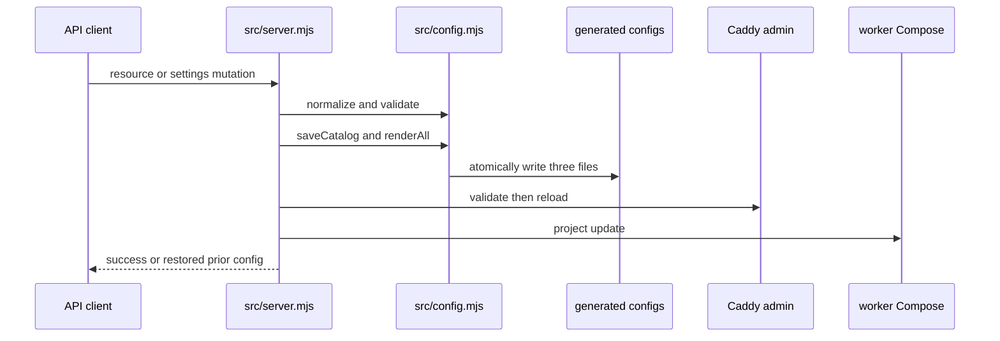

# Catalog 配置模型与运行时渲染

`src/config.mjs` 拥有持久配置的读取、迁移、验证、正规化、导入导出及渲染。运行时使用 `config/catalog.json`；它不存在时 `loadCatalog()` 才回退到 `config/catalog.example.json`。示例的版本为 `1`，含端口/语言/启动设置及五类用户资源；system 控制台 route 是内置项。`renderAll()` 先 `validateCatalog()`，创建生成/运行目录，再以临时文件 rename 原子写入三个生成文件并设为 `0600`。

## 模型与约束

| 对象 | 正规化入口 | 核心字段 | 验证不变量 |
| --- | --- | --- | --- |
| `settings` | `validateCatalog` | console、core、worker、Caddy admin/proxy/public proxy 端口；登录/会话恢复；语言 | 全部运行端口有效；语言仅 `zh-CN` 或 `en-US`。 |
| service | `normalizeService` | `id`、命令、绝对工作目录、`restartPolicy`、可选 `healthUrl` | ID 在 system/service/tunnel 中唯一；重启策略为 `always`/`on_failure`/`no`；健康 URL 必须是 HTTP(S) loopback。 |
| tunnel | `normalizeTunnel` | SSH host/user/port、本地/远端端口、密钥路径、`passphraseRef`、健康 URL | `bindAddress` 强制为 `127.0.0.1`；本地端口唯一；密钥路径绝对；健康 URL loopback。 |
| route | `normalizeRoute` | `host`、可选 path、`target`、enabled | host 必须是 `*.localhost`；target 必须 loopback host:port；path 不能是协议相对/跨 origin/含控制字符。 |
| external service | `normalizeExternalService` | loopback `target`、`healthPath` | 在 `validateCatalog` 中验证目标与路径。 |
| terminal task | `normalizeTerminalTask` | Terminal/iTerm2，命令或 SSH 字段、可选转发、口令引用 | 仅 `terminal`/`iterm2`；SSH 转发 local/remote port 必须成对；私钥路径绝对。 |

`processDefinitions(catalog)` 将 system 定义与 service/tunnel 合并为可操作进程；其中 `local-ops-console` 与 `caddy` 为 protected。`routeUrl()` 根据 `publicProxyPort()` 生成 URL：端口为 80 时不输出端口后缀。

## 从 catalog 到运行时

图：`enqueueMutation()` 串行执行配置变更，`applyRuntimeConfig()` 应用生成结果；失败时恢复旧 catalog 并尝试重渲染和重新应用。

`renderAll()` 生成三个文件：

| 产物 | 生成函数 | 用途 |
| --- | --- | --- |
| `generated/process-compose.yaml` | `renderProcessCompose` | core：`local-ops-console`、Caddy、`local-ops-worker`。控制台有 `/api/health` readiness；Caddy 依赖其 healthy 状态。 |
| `generated/services.yaml` | `renderWorkerCompose` | worker：sentinel、用户服务、隧道。空项目仍有 sentinel。带 `healthUrl` 的服务改用管理包装器；隧道默认 disabled。 |
| `generated/Caddyfile` | `renderCaddyfile` | admin 仅监听 `127.0.0.1:${caddyAdminPort}`；每个启用 route 在 proxy port 绑定 `127.0.0.1 ::1` 并反代其 loopback target。 |

`src/server.mjs` 的 `enqueueMutation()` 先保存、渲染、执行 Caddy validate、worker project update 与 Caddy reload。它维护队列以避免并发 catalog 写入；任何应用失败触发旧配置恢复。资源 CRUD、导入、排序和 settings 都走这条通道，因此修改资源模型时必须同时检查 `normalize*`、`validateCatalog`、渲染函数、API payload 和前端表单。

## 导入导出与机密边界

`createPortableConfigExport()` 输出格式 `local-ops-portable-config`、版本 `1`。它导出启动设置和非 Docker service、tunnel、external service、非 system route、terminal task，但剥离 SSH `passphraseRef`；不含运行会话。`applyPortableConfigImport()` 验证格式和列表类型，保留当前机器的 Docker service 与 system route，并将导入的 tunnel/terminal task 引用置空。导入文档的 `settings.language` 若缺失，保留当前 catalog 的语言再经 `normalizeLanguage()` 处理；若出现则仅接受 `zh-CN` 或 `en-US`。同时，旧的三个启动开关可折算为 `restoreLastSessionOnAppLaunch`。`/api/config/import` 在配置提交后清理不再保留的 Keychain 引用；具体口令仅由 [SSH 隧道](tunnels.md) 所述 helper 处理。

## 修改指南、测试与验证

**新增字段或资源类型**：先扩展正规化与 `validateCatalog`，再确定 public payload 是否需脱敏；随后更新 import/export、render 函数、API CRUD/排序以及 `public/app.js` 消费方。不要绕过 `enqueueMutation()` 直接写 catalog，因为会跳过重新渲染、应用与回滚。

- `tests/config.test.mjs`：验证 core/worker/Caddy 文本、route path/port URL、loopback 拒绝、service/隧道渲染分流、3/40 retry、SSH 口令不进入命令、portable round trip。
- `tests/resource-sync.test.mjs`：bootstrap config 才驱动客户端重绘，token 改变不应被视为资源变更。
- `tests/portless-config.test.mjs`：独立验证代理端口范围和控制面端口冲突。

先运行 `npm test`；只改语法或单文件实现时可先运行 `npm run check`。