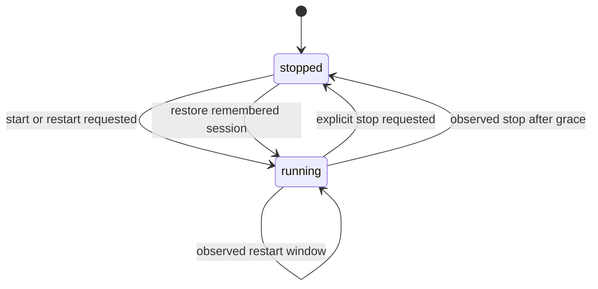

# 进程、服务与会话生命周期

本页说明控制面如何把“用户想要运行”与“编排器此刻观察到运行”分开记录。`src/server.mjs` 的 `processAction()` 为每个进程 ID 建立队列，向 core 或 worker Process Compose 发 start/stop/restart；`src/process-lifecycle.mjs` 在 `runtime/process-lifecycle.json` 保存 `desiredState`、最后动作和审计字段。这样短暂的编排器重载或状态滞后不会错误删除会话恢复意图。

## 动作、审计与状态恢复

图：`desiredState` 以用户/启动动作决定；观察到的停止只有越过宽限并满足审计条件时才改变生命周期记录。

`recordProcessActionRequest()` 接受 `start`、`stop`、`restart`：stop 写 `desiredState: stopped`，其余写 `running`。`processMutationActor()` 只接受 `ui`、`tray`、`api`、`app-startup`、`app-quit`、`orchestrator`、`health`，未知值回退 `api`。可选审计字段是 event name、action ID、call path、明确用户意图。

两个关键保护：

1. `shouldAuditObservedStop()` 对 start 后 `OBSERVED_STOP_GRACE_MS`（5 秒）内的 inactive/completed 观察值不审计为真实 stop，防止编排器陈旧状态抹掉刚请求的运行状态。
2. `reconcileRememberedProcessIds()` 捕获会话时优先采纳 `desiredState: running`；先前记住但未确认的 tray stop 会恢复为 running，并写原因 `preserved_unconfirmed_tray_stop`。明确 UI/API stop 或已确认 tray stop 不会被记住。

`/api/processes/:id/(start|stop|restart)` 先校验 ID；protected 系统进程不能网页 stop。隧道 stop 若请求来源是 tray 且没有 `userIntentConfirmed: true`，控制面返回 409。操作前后会记录审计、设置隧道状态和刷新 state cache；隧道细节见[SSH 隧道](tunnels.md)。

## 有健康 URL 的服务为何有监督器

无 `healthUrl` 的 service 由 worker 直接执行 `service.command`。有 `healthUrl` 时 `renderWorkerCompose()` 使用 `managedServiceCommand()` 运行 `scripts/run-managed-service.mjs`，状态位于 `runtime/services/<id>.json`。`src/managed-service.mjs` 提供读写、PID 存活检查、对账和完整进程树终止。

| 场景 | 实现 | 可见语义 |
| --- | --- | --- |
| 编排器误报结束 | `reconcileManagedServiceProcess` | tracked child 仍活着则报告 `running`、`active: true` 与真实 child PID。 |
| 重复启动 | wrapper 的 `supervise` | 同 ID/命令 hash 且 wrapper/child 均活着时阻止副本；若 wrapper 已丢失但 child 活着则 adopt。 |
| 健康端口已被外部进程占用 | `localHealthEndpoint` + `probeTcpListener` | 不执行用户命令，记录 `port_conflict`；对外显示 active 但 `degraded`，避免无限重启。 |
| 停止 | `stopManagedServiceRuntime` / wrapper `stop` | 以子先父后的树遍历发 SIGTERM，4 秒后 SIGKILL；状态写 `stopped`。 |
| HTTP 健康 | `enrichServiceProcess` | 仅影响 `healthy`/`degraded` 与 `serviceReady`，不因 5xx/超时自动杀掉运行进程。 |

因此修改服务启动、PID 对账或停止逻辑时，必须同时保持 runner state 的 `serviceId`/`commandHash`/PID/phase 协议，和 `getState()` 中对受管服务的 `reconcileManagedServiceProcess()` 调用一致。

## 会话、Docker 和终端任务

`captureLastSessionState()` 将 desired-running service/tunnel 和正在运行的 Docker 容器引用写入 `config/last-session.json`；`applyAppStartupActions()` 仅在 `restoreLastSessionOnAppLaunch` 为真时恢复。服务/隧道恢复经过 process action；恢复隧道使用 40 次预算，且缺失 Keychain 口令会被收集为错误而非启动。Docker 恢复由 `ensureDockerEngine()` 确认 CLI；必要时打开 Docker Desktop，最长轮询 2 分钟等待 daemon，随后按 ID/name/Compose 标签匹配容器。

Docker 的即时状态来自 `getDockerState()`：分别呈现 CLI 不存在、daemon 未就绪和容器列表。终端任务由 `launchTerminalTask()` 调用 `buildTerminalAppleScript()`，根据 `terminalApp` 选择 Terminal 的 `do script` 或 iTerm2 的 `write text`；SSH 任务运行前验证口令引用。它们是“启动已有外部工具”的动作，并非 worker 受管资源。

## 测试与验证

- `tests/process-lifecycle.test.mjs`：行为者白名单、UI header、5 秒宽限、desired-running 的会话保存、显式/未确认/已确认 tray stop。
- `tests/managed-service.test.mjs`：child 对账、端口冲突不执行命令且不重启、完整进程树清理、重复监督器清理。
- `tests/service-health.test.mjs`：503/超时降级但保持 PID/active、冲突状态与无 health URL 的原样返回。
- `tests/smoke.mjs`：实例级 service CRUD、日志、start/restart/stop 与会话恢复。

改动 lifecycle 或 runner 时先运行 `node --test tests/process-lifecycle.test.mjs tests/managed-service.test.mjs tests/service-health.test.mjs`，再运行 `npm test`。