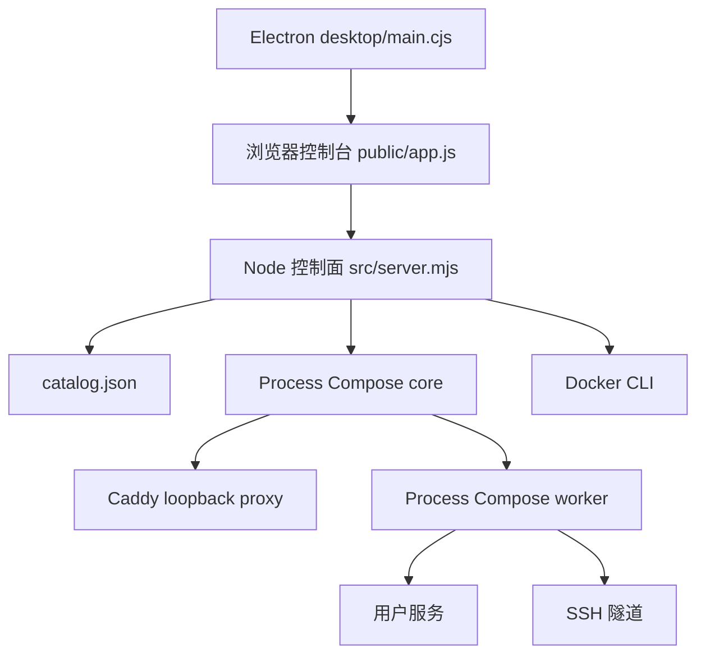

# Local Ops Console 项目总览与控制面边界

Local Ops 是面向 macOS 的本机控制台：它用浏览器界面和 Electron 壳管理用户命令服务、SSH 本地转发、反向代理路由、已有 Docker 容器及终端任务。运行时没有账户或远程控制服务；源码把控制面监听、反代目标、SSH 监听和健康 URL 都限制在 loopback。面向使用的人工说明在 [../docs/USER_GUIDE.md](../docs/USER_GUIDE.md)，本页只记录源码可验证的实现边界。

## 运行组成与数据路径

`src/server.mjs` 是 Node HTTP 控制面入口；`public/index.html` 与 `public/app.js` 是同一个网页控制台的静态客户端。`src/config.mjs` 将 catalog 渲染为 core Process Compose、worker Process Compose 和 Caddy 配置。core 运行控制台、Caddy、worker；worker 运行用户服务和隧道。详情分别见[配置与运行时渲染](configuration.md)、[进程与会话生命周期](lifecycle.md)和[SSH 隧道](tunnels.md)。

图：控制台请求经 Node 控制面读取配置、控制编排器或按需调用 Docker；桌面壳加载同一网页控制台。

### 入口与责任

| 层 | 入口/关键符号 | 责任与边界 |
| --- | --- | --- |
| 控制面 | `src/server.mjs`、`server` | 监听 `127.0.0.1:${consolePort}`；提供 API 和 `public/` 静态文件。 |
| 网页 | `public/index.html`、`public/app.js` 的 `initialize`、`refresh`、`request` | 取 bootstrap/state，渲染总览、服务、隧道、路由、Docker、终端和设置；变更请求携带 CSRF token 与 `X-Local-Ops-Requested-By: ui`。 |
| 配置与编排 | `src/config.mjs` 的 `renderAll` | 生成 core/worker Compose 与 Caddyfile；不把用户资源直接塞入控制台进程。 |
| 桌面壳 | `desktop/main.cjs` 的 `app.whenReady`、`connectControlPlane` | 创建受隔离窗口和托盘，连接 `http://127.0.0.1:19090/`；不能连接时加载离线页并重连。 |
| 桌面桥 | `desktop/preload.cjs` | 仅暴露 portless、登录项、配置文件和托盘 panel 的固定 IPC；不提供通用 Node 或 IPC 访问。 |

Electron 的 `BrowserWindow` 明确设置 `nodeIntegration: false`、`contextIsolation: true`、`sandbox: true`、`webSecurity: true`；窗口导航、弹窗和 webview 也受限制。因此桌面版是网页控制台的宿主，不是给 `public/app.js` 增加 Node 权限的替代通道。

## HTTP API 与安全不变量

请求先通过 `isAllowedHost`，再路由；所有非 `GET`/`HEAD` 请求都调用 `assertMutationRequest`。CSRF token 在控制面启动时随机生成，并只随 `GET /api/bootstrap` 返回。带 `Origin` 的变更请求还必须来自允许的直连或 `console.localhost` origin。静态服务 `serveStatic` 解析后必须仍位于 `public/` 内。

| 范围 | 路由 | 关键行为 |
| --- | --- | --- |
| 发现/读取 | `GET /api/health`、`/api/bootstrap`、`/api/state?fresh=1`、`/api/docker?fresh=1`、`/api/logs/:id` | bootstrap 给网页 token 与经 `publicCatalog` 处理的配置；state 合并编排器、生命周期和健康信息。state/docker 默认缓存 1.8 秒。 |
| 进程与 Docker | `POST /api/processes/:id/(start|stop|restart)`、`/api/docker/:id/(start|stop|restart)`、`/api/docker/start-all`、`/api/docker/desktop/start` | 进程 ID 必须已知；受保护的控制台/Caddy 不能由网页停止。Docker 动作先确认 CLI、daemon 和容器。 |
| 资源 | `POST|PUT|DELETE /api/services`、`/api/tunnels`、`/api/routes`、`/api/terminal-tasks` | 统一通过配置正规化和串行 mutation。服务可同时创建同 ID route；删除服务也删除对应非 system route。隧道端口不可重复，system route 不可编辑或删除。 |
| 配置/会话 | `GET /api/config/export`、`POST /api/config/import`、`PATCH /api/settings`、`POST /api/reload`、`/api/session/capture`、`/api/startup/app` | 导入上限 2 MiB；导出和导入的脱敏/保留规则见[配置页](configuration.md)。 |
| 辅助动作 | `PUT /api/order/(services|tunnels|routes|terminal-tasks)`、`POST /api/terminal-tasks/:id/run` | 排序 IDs 必须完整覆盖可移动项；终端 SSH 动作会先验证口令引用可用。 |

安全头由 `setSecurityHeaders` 设置：CSP 以 `'self'` 为默认和连接来源，禁止 framing，且设置 `nosniff` 与无 referrer。允许 Host 是控制台端口的 loopback 名称，以及按配置代理端口访问的 `console.localhost`；其他 Host 返回 421。当前实现中，不携带 `Origin` 的变更请求可继续，但仍必须有正确 token；若携带 `Origin`，它必须是允许的直连或代理控制台 origin。配置验证还要求 route target、服务健康 URL 与隧道绑定都是 loopback，见[配置页](configuration.md)。

浏览器响应由 `publicCatalog()` 统一经过 `publicSshResource()`：它删除 tunnel 和 SSH terminal task 的 `passphraseRef`，并以 `hasKeyPassphrase` 告知该资源是否配置了口令引用。新增会修改配置或进程状态的路由应放在 request handler 中非读取方法的 `assertMutationRequest()` 之后，使用既有 `validateInput()`/mutation 路径；若控制进程，还必须经 `assertKnownProcess()`，并保持 protected process 的网页 stop 禁止与 tray tunnel stop 的确认检查。

## 本机安装、桌面与运维边界

源码安装链由 `scripts/install.zsh` 实现：安装/定位 Node、Caddy、Process Compose，复制运行时，保留已有 catalog/token，构建 Keychain helper，渲染配置，并注册当前用户的 LaunchAgent。该 Agent 执行 `scripts/start-stack.zsh`：先渲染配置，随后以 `--address 127.0.0.1` 启动 core Process Compose。`scripts/opsctl.zsh` 是本机运维入口，分别连接 core 和 worker 的 loopback Process Compose API；其 `process` 子命令先从 bootstrap 获取 token 再调用控制面 API。

打包应用由 `desktop/main.cjs` 的 `ensureBundledBackend`、`installBundledBackend`、`installLaunchAgent` 与 `bootstrapLaunchAgent` 管理同一类本机后端安装与启动；`ensureControlPlane` 先探测 health，再 kickstart 或 bootstrap 用户 LaunchAgent。相关安装细节应以人工 [../docs/DEVELOPMENT.md](../docs/DEVELOPMENT.md) 为准，本页不复制其叙事。

可选的无端口访问是一个受限的本机特权面：`setPortlessAccess`、`setProxyPort`、`runElevatedShell` 管理 PF anchor/privileged helper；`desktop/portless-config.cjs` 的 `normalizeProxyPort` 仅接受 1024–65535，并以 `conflictingRuntimePort` 拒绝与 console、core/worker Process Compose、Caddy admin 端口冲突。模板必须同时替换 IPv4/IPv6 loopback 的端口占位符。此能力不改变控制面仍以 loopback 为边界的事实。

## 聚焦测试与最小验证

- `tests/smoke.mjs`：运行实例的 CSP/frame、错误 token（403）、恶意 Origin（403）、恶意 Host（421）、资源 CRUD、会话恢复、路由反代和导出脱敏。
- `tests/browser-qa.mjs`：严格 CSP 下的浏览器控制台无 CSP/异常错误，窄屏表格可横向滚动。
- `tests/process-lifecycle.test.mjs`：断言网页客户端设置 `X-Local-Ops-Requested-By: ui`，并验证审计语义。
- `tests/window-lifecycle.test.mjs`、`tests/tray-action.test.mjs`、`tests/startup-mode.test.mjs`：窗口恢复、托盘可信动作和启动呈现。
- `tests/portless-config.test.mjs`：PF 双 loopback 规则、端口范围、模板占位符与运行时端口冲突。

最小静态检查是 `npm run check`；控制面单元/集成回归使用 `npm test`。需要已运行本机栈、会创建并清理临时资源的 smoke 检查才运行 `npm run test:smoke`。