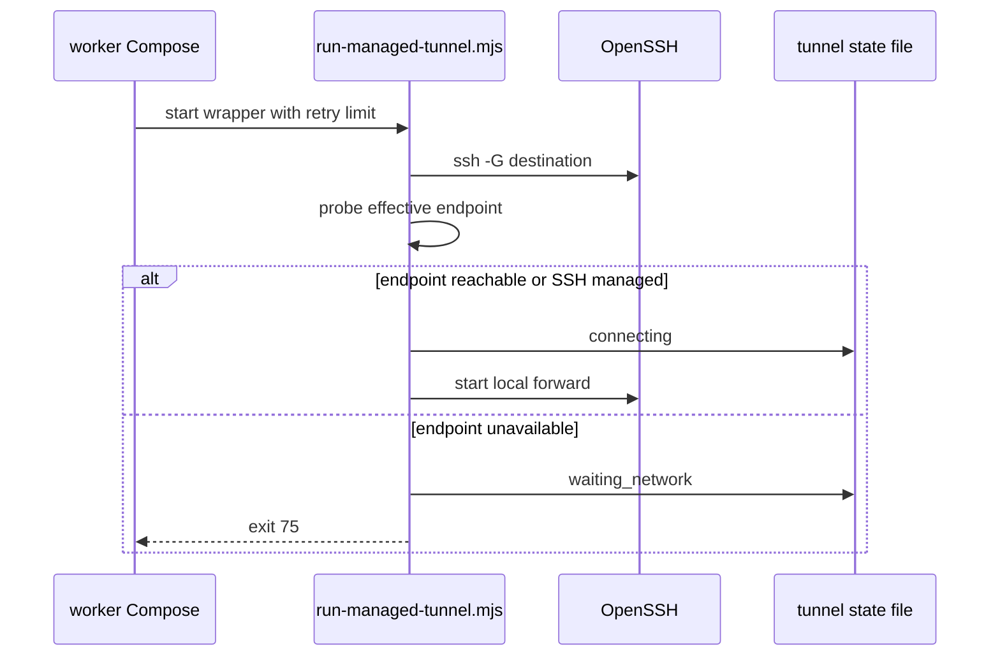

# SSH 隧道、网络门控与健康状态

隧道是 worker 管理的 SSH 本地转发，而不是对外监听器。`normalizeTunnel()` 固定 `bindAddress: "127.0.0.1"`，`renderWorkerCompose()` 生成 `-L 127.0.0.1:localPort:remoteHost:remotePort`，并以 `scripts/run-managed-tunnel.mjs` 包装实际 SSH 命令。相同 `localPort` 的隧道不能共存。隧道的配置/生成事务见[配置页](configuration.md)，动作审计和会话恢复见[生命周期页](lifecycle.md)。

## 命令、口令与启动门控

`renderSshCommand()` 总会插入 `ConnectTimeout=5` 与 `ConnectionAttempts=1`。后台命令没有口令引用时增加 `BatchMode=yes`；有 `passphraseRef` 时改为 `SSH_ASKPASS` 环境变量、Keychain helper 路径和 account reference，并禁用 password/KBD interactive authentication。生成的命令不包含口令文本。

`src/keychain.mjs` 仅处理 UUID 形式的引用和最多 16 KiB、无 NUL 的口令；`storePrivateKeyPassphrase`、`readPrivateKeyPassphrase`、`hasPrivateKeyPassphrase`、`deletePrivateKeyPassphrase` 调 native helper。控制面向网页公开 tunnel/task 时经 `publicSshResource` 隐去 `passphraseRef`；portable export 也剥离引用。隧道启动/重启与终端 SSH 任务运行前都会要求引用存在。

图：runner 先解析有效 SSH 配置并进行网络门控；普通端点不可达时以 75 退出，让编排器按 3 秒 backoff 再调度。

`resolveSshEndpoint()` 通过 `ssh -G` 取得实际 HostName/Port。普通连接使用 1.5 秒 TCP probe；`ProxyJump`/`ProxyCommand` 被 `isSshManagedConnection()` 识别后，状态使用 `ssh-managed`、`delegated: true`、`ok: null`，可达性由 OpenSSH 负责而不是错误地直连最终主机。不可达状态写 `waiting_network`、`nextCheckAt` 和错误，runner exit code 为 75；下次调度在端点恢复后可直接进入 connecting。

手动启动/重试的预算是 3（`TUNNEL_MANUAL_RETRY_LIMIT`）；会话恢复预算是 40（`TUNNEL_STARTUP_RETRY_LIMIT`）。worker 配置有 `restart: always`、3 秒 backoff 和对应 `max_restarts`，但新隧道默认 disabled，只有动作或恢复流程启用。

## 三层健康与状态语义

`enrichTunnelProcess()` 将编排器状态、runner 网络状态和探针结果合并；它维护内存运行时记录，以 PID 切换作为一次新连接的开始。关键状态是 `stopped`、`waiting_network`、`connecting`、`retrying`、`connected`、`connection_failed`。

| 层 | 符号 | 成功定义 | 失败影响 |
| --- | --- | --- | --- |
| SSH liveness | `probeTunnel` | 到隧道 loopback listener 的 TCP 可连接 | 连接窗口前为 `connecting`，之后为 `retrying`；进程终态错误为 `connection_failed`。 |
| 转发应用 readiness | `probeTunnelReadiness` | 可选 `healthUrl` HTTP 状态小于 500 | 仅标记 `degraded`，不杀健康 SSH 进程，也不消费 SSH 重启预算。超时 10 秒。 |
| 域名入口 | `probeDomainEntries` | 所有关联且启用 route 的完整 URL 成功；2xx/3xx 和 401/403 均可证明应用响应 | 连接保持 active 但为 degraded/retrying；失败达到当前 retry budget 后 `connection_failed`，仍每 30 秒低频恢复探测。 |

`getState()` 用 `routeTargetsTunnel()` 依 route target 的 loopback port 关联入口；不会把同一 URL 复制进 tunnel 配置。`fullyAvailable` 因而要求 SSH listener 与已配置 domain entry 均就绪。`public/tunnel-ui.js` 则把底层多个阶段压缩为四个用户态：stopped、connecting、connected、connection_failed；readiness 503 可以保留 connected 显示但标识降级，域名入口未 ready 则不会展示为连接完成。

停止时 runner 读取已写入的 `stopping` 上下文，结束后写 `stopped` 并通过 `recordProcessLifecycle()` 保存请求者/原因；若没有上下文，来源为 orchestrator 信号。这使明确 stop 的审计不会被网络/编排器退出混淆。

## 修改面、测试与验证

修改 tunnel 字段或 SSH 选项需一起检查：`normalizeTunnel`/`validateCatalog`、`renderWorkerCompose`/`managedTunnelCommand`、runner 参数解析、`tunnel-network.mjs`、`tunnel-health.mjs`、`public/tunnel-ui.js` 和 API 脱敏输出。

- `tests/config.test.mjs`：SSH 命令选项、loopback 约束、禁用默认、3/40 预算、Keychain 环境与无口令明文。
- `tests/tunnel-network.test.mjs`：`ssh -G`、ProxyJump/ProxyCommand 委托、exit 75、端点恢复、停止审计。
- `tests/tunnel-health.test.mjs`：连接窗口、SSH/HTTP 分离、401/403 入口、预算耗尽和 30 秒恢复探测。
- `tests/tunnel-http-health.test.mjs`：403、503、loopback 拒绝与 waiting/connecting 宽限。
- `tests/tunnel-ui.test.mjs`：四态映射和主动作约定。

聚焦验证：`node --test tests/tunnel-network.test.mjs tests/tunnel-health.test.mjs tests/tunnel-http-health.test.mjs tests/tunnel-ui.test.mjs`；随后运行 `npm test`。